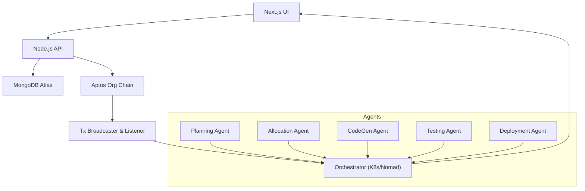

# 🚀 Zenith

**Jira saw us and Left the Group Chat :<**

---

## 📌 About Zenith

Zenith unifies your entire software development lifecycle—planning, coding, testing, deployment, and resource allocation—into a single intelligent system. Powered by autonomous AI agents and anchored on a private Aptos blockchain, Zenith delivers seamless automation, immutable audit trails, and decentralized infrastructure to help enterprises build smarter, move faster, and trust deeper.

---

## 🎯 Key Core Features

1. **Autonomous AI Agents**

   * **Planning Agent**: Breaks down user stories into actionable tasks.
   * **Allocation Agent**: Matches tasks to team members using skills and workload analytics.
   * **CodeGen, Testing & Deployment Agents**: Generate boilerplate code, execute CI/E2E tests, and orchestrate container rollouts.

2. **Blockchain-Backed Audit Trail**

   * Every action (task creation, assignment, completion) is immutably logged on a private Aptos chain for full compliance and transparency.

3. **Unified DevOps OS**

   * Replace Jira, Jenkins, GitLab, and fragmented scripts with a single cohesive platform for end-to-end product development.

4. **Decentralized Infrastructure**

   * Leverage your own company machines as validator nodes—eliminate cloud bills, ensure sovereignty, and boost resilience.

5. **Smart Resource Allocation**

   * Predictive AI dynamically allocates compute and human resources to maximize throughput and minimize bottlenecks.

---

## 🔍 SWOL Analysis

* **Strengths**: Unified platform; on-chain transparency; AI-driven automation; cost-saving via decentralized nodes.
* **Weaknesses**: Migration complexity; potential latency from blockchain consensus; resistance from entrenched incumbents.
* **Opportunities**: Rising demand for DevOps automation; strict audit/compliance needs; expansion into governance and security modules.
* **Threats**: Atlassian/GitHub budgets; blockchain skepticism; security vulnerabilities if not robustly implemented.

---

## 🖥️ Architecture Overview

---

## ⚙️ Tech Stack

* **Frontend**: Next.js 15 · React 19 · Tailwind CSS · Framer Motion
* **Backend**: Node.js · Express · MongoDB Atlas
* **Blockchain**: Aptos (Private Org Chain)
* **AI Agents**: Dockerized Python (LangChain-based)
* **Orchestration**: Kubernetes / Nomad
* **Auth**: Civic Web3 passwordless oauth

---
